# WasteManagement API - Projeto com CI/CD, Docker e SQLite

Tema: Gestão de resíduos e reciclagem  
Framework: ASP.NET Core 8 (.NET 8)  
Banco: SQLite

---

## 📦 O que está incluso

- API com arquitetura simples:
  - Models
  - ViewModels
  - Services
  - Repositories
  - Controllers

### 🔗 Endpoints disponíveis

- GET /api/collections?page=1&pageSize=10
- GET /api/collections/{id}
- POST /api/collections
- GET /api/alerts
- POST /api/alerts
- GET /api/reports/summary
- POST /api/sensors/telemetry

---

## 🧪 Testes

- Testes automatizados com xUnit
- Um teste por controller com validação de status HTTP 200

---

## 🐳 Containerização

O projeto foi containerizado utilizando Docker com:

- Multi-stage build
- Imagem base ASP.NET 8
- Separação entre ambiente de build e execução
- Persistência de dados com Docker Volume (SQLite)

Dockerfile localizado em:  
src/WasteManagement.API/Dockerfile

---

## ⚙️ Orquestração com Docker Compose

Foi utilizado Docker Compose para orquestrar a aplicação.

Serviços:

- API .NET 8
- Volume persistente para SQLite

O banco de dados é persistido via volume Docker no caminho:  
/app/data/waste.db

---

## ▶️ Como executar com Docker

Na raiz do projeto:

```bash
docker-compose up --build
```

A aplicação ficará disponível em:

http://localhost:8080/swagger

---

## 🔁 Pipeline CI/CD

O projeto utiliza GitHub Actions para automação do ciclo de vida da aplicação.

O pipeline é executado automaticamente a cada push nas branches:

- staging
- main

Etapas do pipeline:

- Checkout do código
- Setup do ambiente .NET 8
- Restore das dependências
- Build da aplicação
- Execução de testes automatizados
- Deploy simulado na branch staging
- Deploy simulado na branch main

Local do pipeline:
.github/workflows/ci-cd.yml

---

## 💻 Execução local (sem Docker)

1. Verifique o .NET 8:

```bash
dotnet --version
```

2. Navegue até o projeto:

```bash
cd src/WasteManagement.API
```

3. Restaurar e rodar:

```bash
dotnet restore
dotnet run
```

A API ficará disponível em:

- https://localhost:5001
- http://localhost:5000

---

## 🧪 Executar testes

```bash
cd tests/WasteManagement.Tests
dotnet test
```

---

## 🗄️ Banco de Dados

- SQLite
- Persistido via Docker Volume
- Caminho no container: /app/data/waste.db

Script opcional disponível em:
migrations/create_tables.sql

---

## 📸 Evidências

- Execução do Docker (build + subida do container)

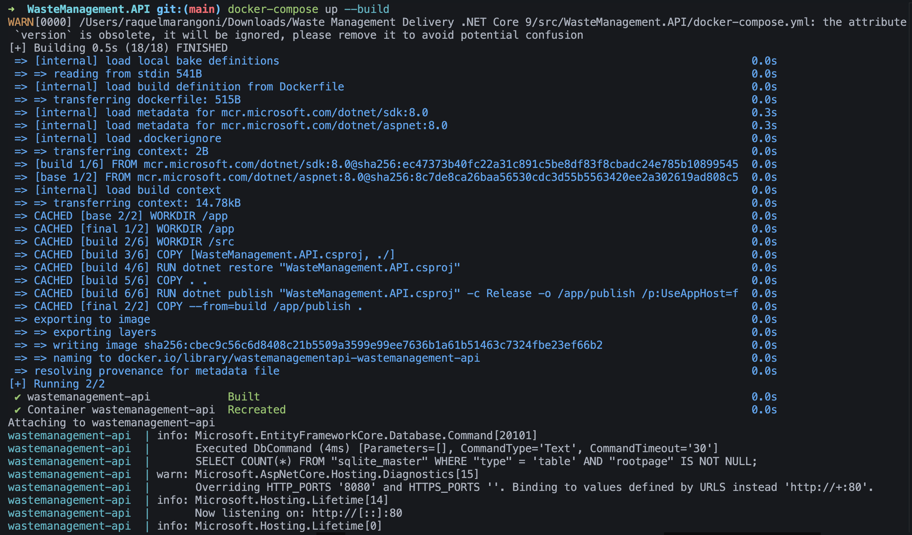
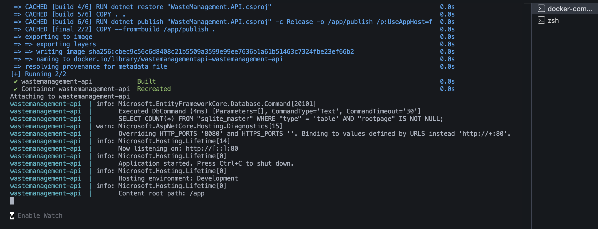

- Swagger em execução

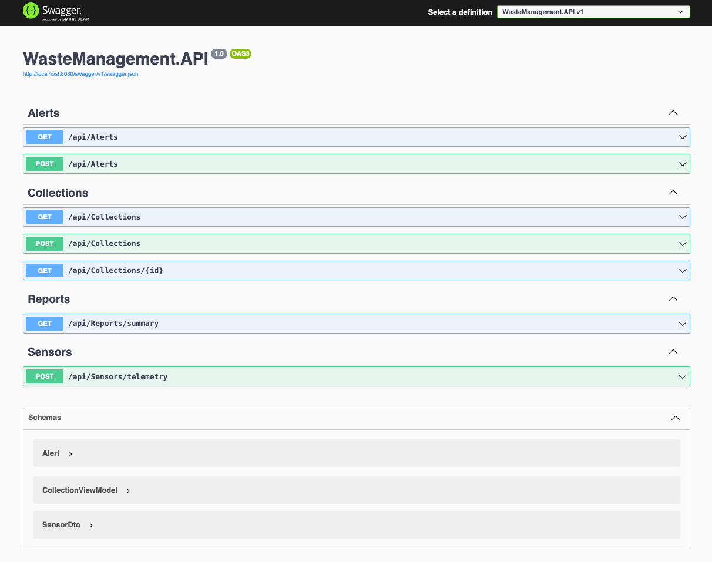

- Execução do pipeline (branch staging)

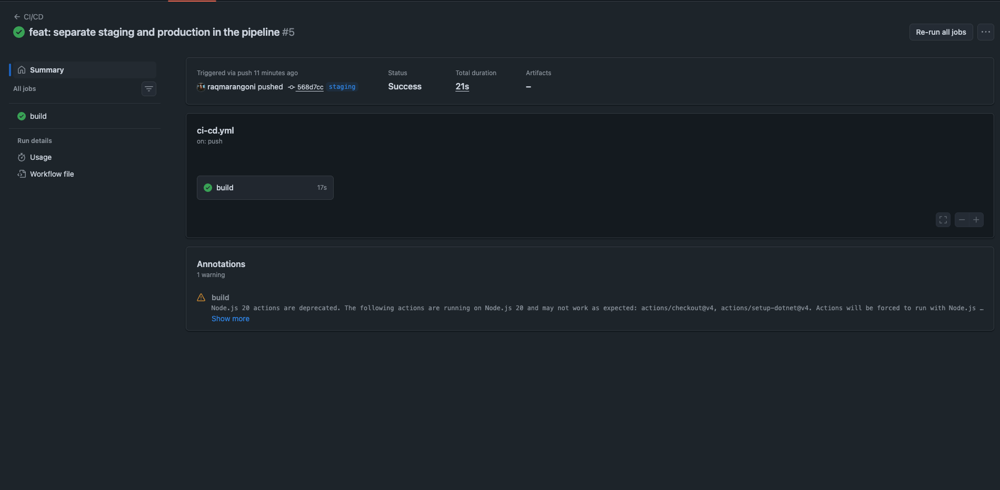
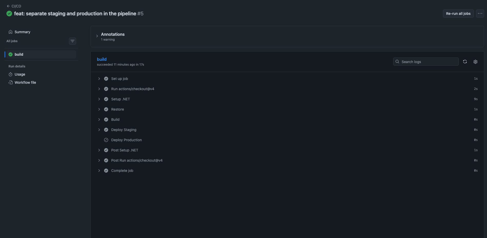
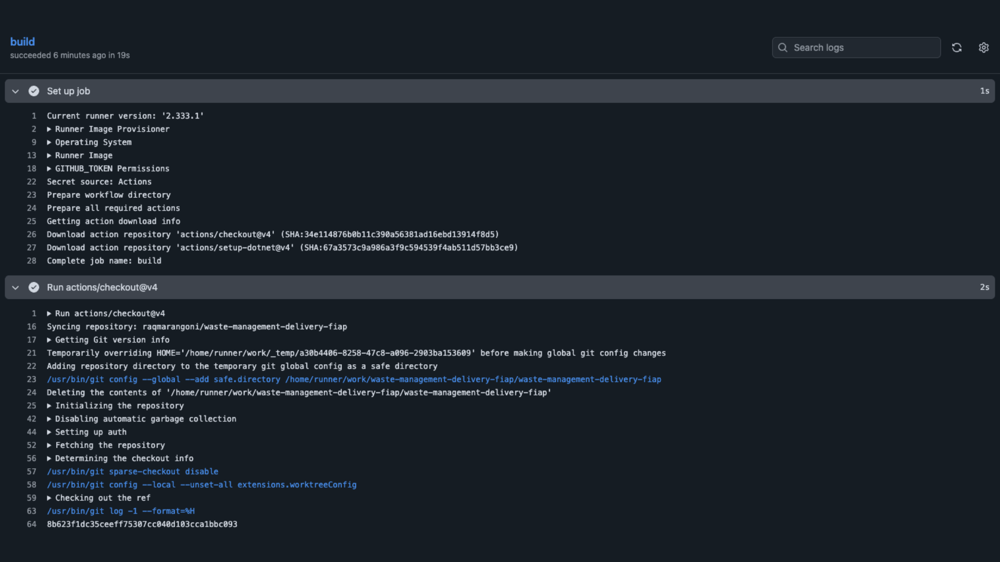
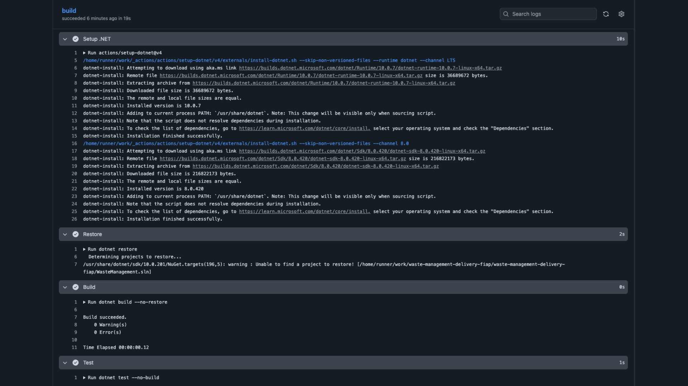
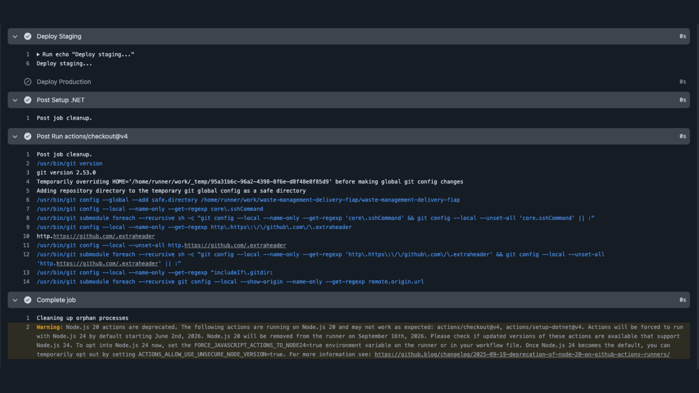

- Execução do pipeline (branch main)

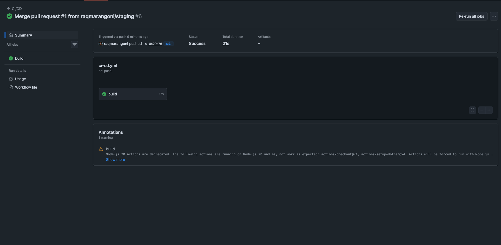
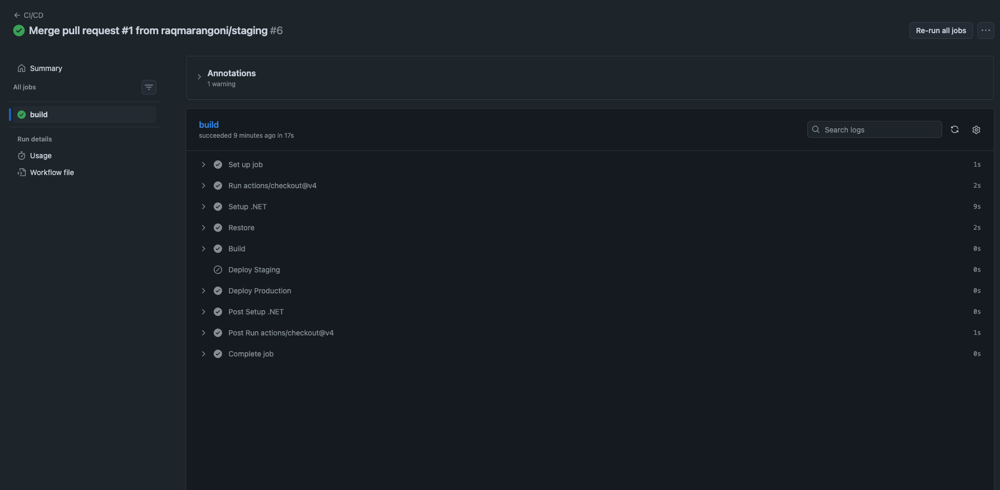
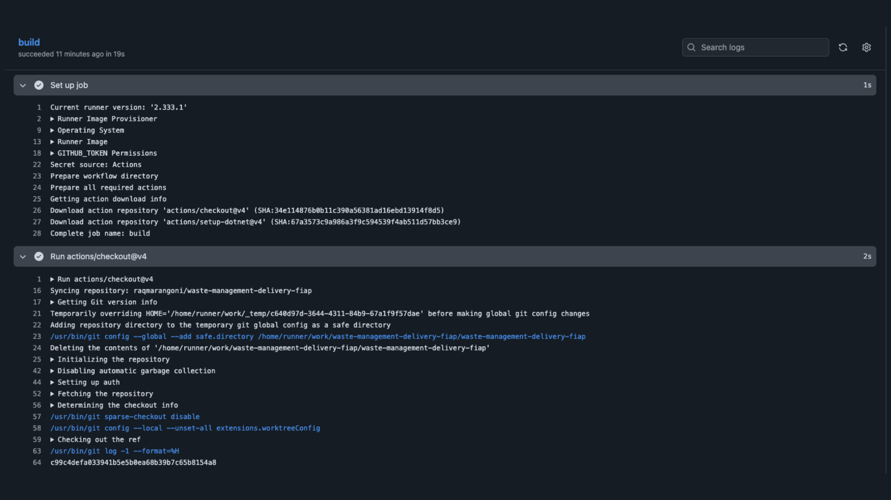
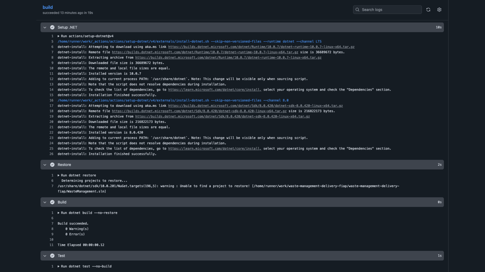
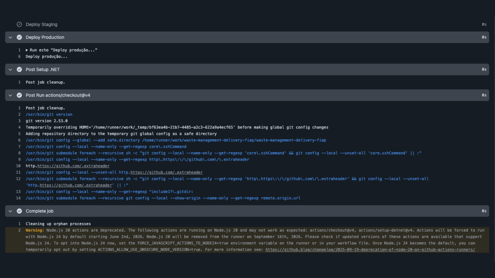

---

## 🧰 Tecnologias utilizadas

- ASP.NET Core 8
- Entity Framework Core
- SQLite
- Docker
- Docker Compose
- GitHub Actions
- xUnit

---

## 📌 Considerações finais

O projeto foi estruturado para simular um fluxo de DevOps com:

- Automação de build e deploy
- Containerização da aplicação
- Persistência de dados com Docker Volume
- Execução de testes automatizados
- Pipeline CI/CD com separação por branch (staging e main)

---